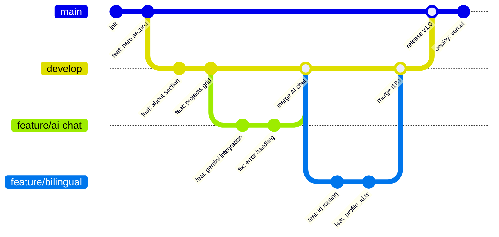
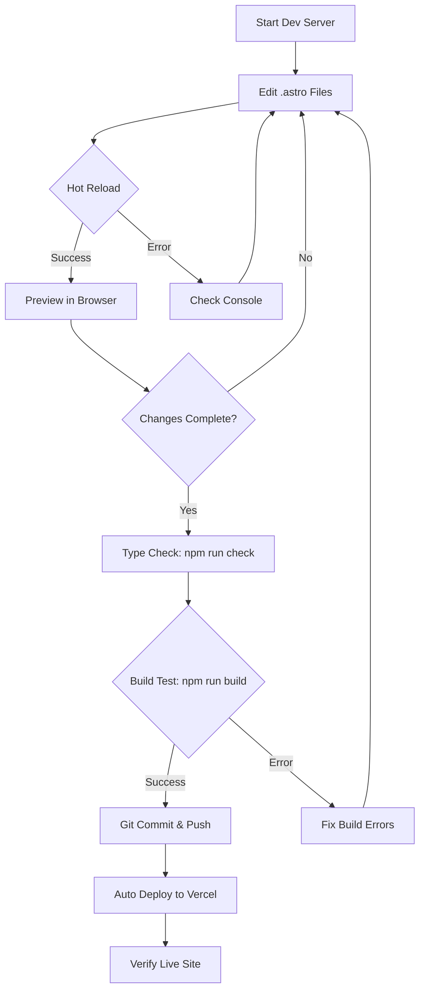
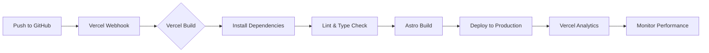
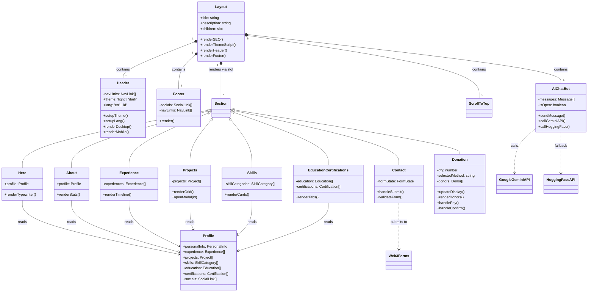
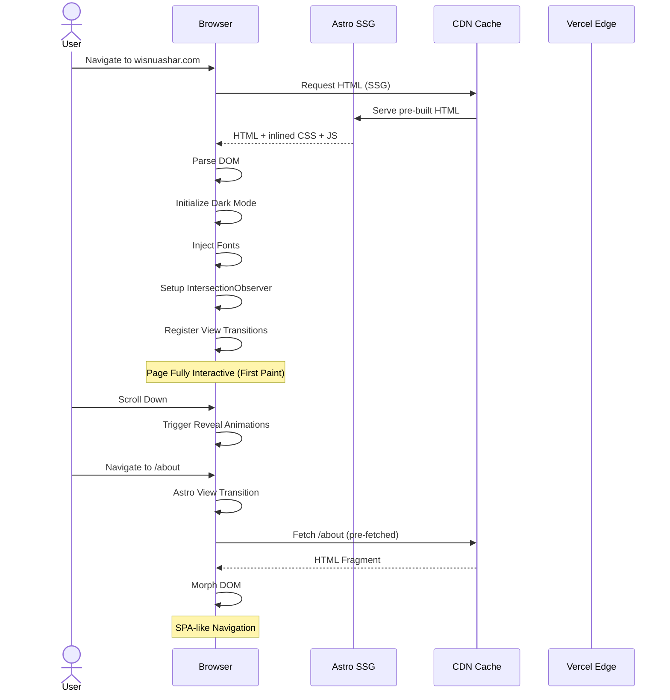
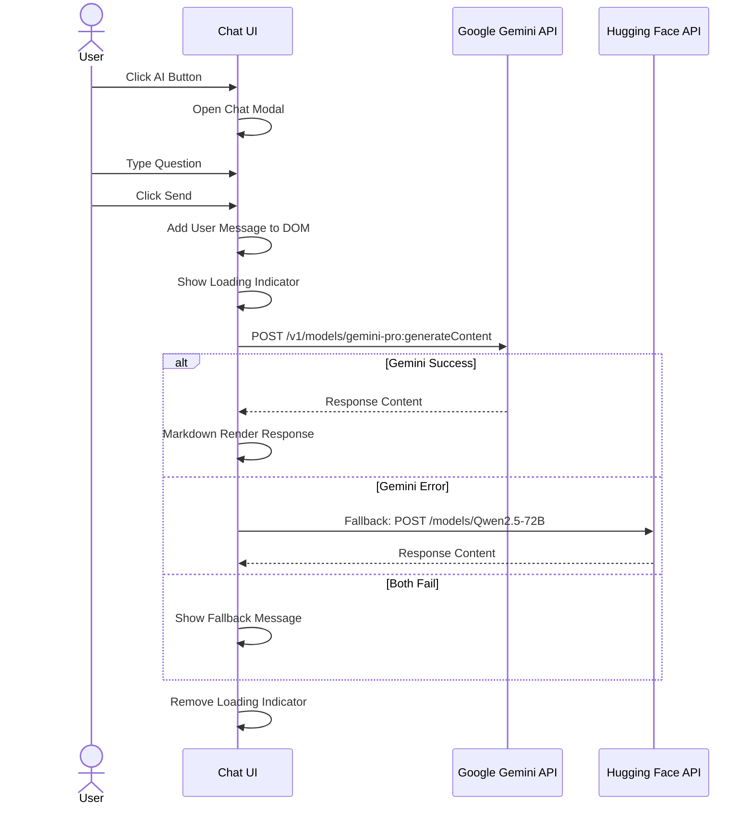
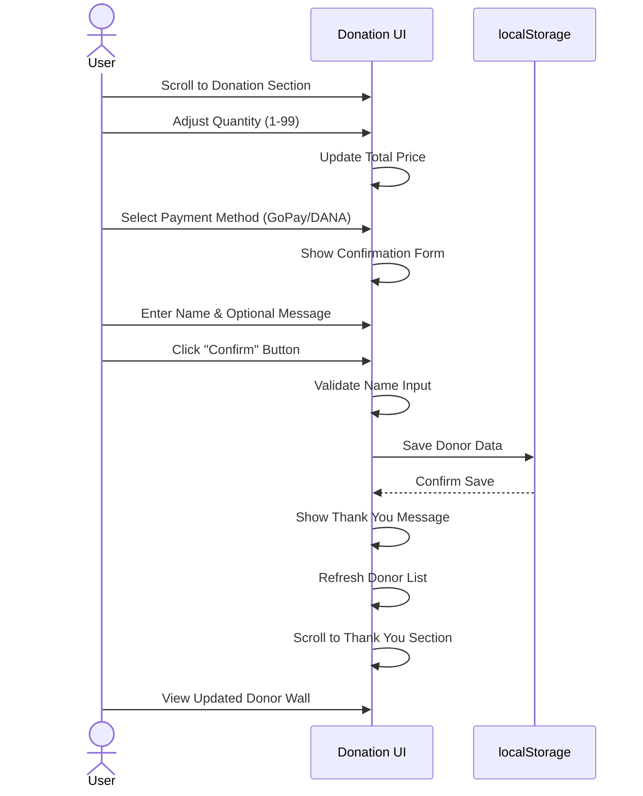
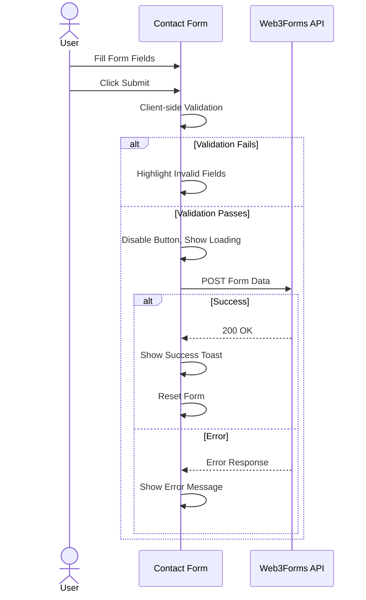

# Wisnu Alfian Nur Ashar — Professional Portfolio

[](https://astro.build)
[](https://tailwindcss.com)
[](https://www.typescriptlang.org)
[](https://react.dev)
[](https://opensource.org/licenses/MIT)
[](https://vercel.com)
[](https://ai.google.dev)
[](https://developer.chrome.com/docs/lighthouse)

> **Live Demo:** [wisnuashar.com](https://wisnuashar.com)

A high-performance, production-grade professional portfolio built with the modern Astro island architecture. Showcases full-stack development and cyber security expertise with an intelligent AI chatbot assistant, bilingual localization, and responsive design.

---

## Key Features

| Feature | Description |
|---------|-------------|
| **Dark/Light Mode** | System-aware theme switching with FOUC prevention, persisted via `localStorage` |
| **Bilingual (EN/ID)** | Full English & Indonesian localization with path-based routing (`/id`) |
| **AI Chatbot** | Hybrid AI assistant powered by Google Gemini Pro API answering 400+ questions |
| **Static Site Generation** | Blazing fast 95+ Lighthouse scores via Astro SSG + island architecture |
| **Responsive Design** | Mobile-first layout with custom "Sage Green & Steel Blue" aesthetic |
| **View Transitions** | SPA-like navigation with Astro 6's built-in view transition API |
| **SEO Optimized** | Open Graph, Twitter Cards, JSON-LD structured data, sitemap |
| **Donation System** | Buy Me a Donut feature with GoPay & DANA support, live donor wall |
| **CV Page** | Print-optimized resume page with ATS-friendly formatting |
| **Scroll Animations** | Intersection Observer-based reveal animations (up/down/left/right/zoom) |

---

## Tech Stack

### Frontend
- **Framework:** [Astro 6.3](https://astro.build) — Island Architecture, SSG, View Transitions
- **Styling:** [Tailwind CSS 4.1](https://tailwindcss.com) — Utility-first CSS via `@tailwindcss/vite`
- **Icons:** [Lucide](https://lucide.dev) via `lucide-astro`
- **Fonts:** Outfit (sans-serif), Cormorant Garamond (serif) via `@fontsource`
- **Language:** TypeScript 5.9

### Backend & Integrations
- **AI Engine:** Google Gemini Pro API + Hugging Face (Qwen2.5-72B, Llama-3.2)
- **Form Handling:** Web3Forms (serverless form submission)
- **Analytics:** Vercel Web Analytics
- **Deployment:** Vercel via `@astrojs/vercel` adapter
- **SEO:** `@astrojs/sitemap`, Open Graph, Twitter Cards, Schema.org JSON-LD

### Tooling
- **Package Manager:** npm
- **Build Tools:** `astro-compress`, Vite, Tailwind CSS Vite plugin
- **Type Checking:** `@astrojs/check` + TypeScript 5.9

---

## Architecture

### System Architecture Overview

```
┌──────────────────────────────────────────────────────────┐
│                    User's Browser                          │
│  ┌──────────┐  ┌──────────┐  ┌────────────────────────┐ │
│  │   HTML   │  │   CSS    │  │  Client-Side Scripts   │ │
│  │ (SSG'd)  │  │(Tailwind)│  │  (View Transitions,    │ │
│  │          │  │          │  │   AI Chat, Donations)   │ │
│  └────┬─────┘  └────┬─────┘  └───────────┬────────────┘ │
│       │             │                     │              │
└───────┼─────────────┼─────────────────────┼──────────────┘
        │             │                     │
        ▼             ▼                     ▼
┌──────────────────────────────────────────────────────────┐
│                    Astro Build Pipeline                    │
│  ┌──────────┐  ┌──────────┐  ┌────────────────────────┐ │
│  │  Pages   │  │Components│  │     Layouts + Data     │ │
│  │ (SSG)    │  │(Islands) │  │     (profile.ts)       │ │
│  └────┬─────┘  └────┬─────┘  └───────────┬────────────┘ │
│       │             │                     │              │
└───────┼─────────────┼─────────────────────┼──────────────┘
        │             │                     │
        ▼             ▼                     ▼
┌──────────────────────────────────────────────────────────┐
│                     External Services                     │
│  ┌──────────┐  ┌──────────┐  ┌────────────────────────┐ │
│  │  Google  │  │ Web3Forms │  │   Hugging Face API    │ │
│  │  Gemini  │  │ (Contact) │  │   (Fallback Models)   │ │
│  └──────────┘  └──────────┘  └────────────────────────┘ │
└──────────────────────────────────────────────────────────┘
```

### Data Flow

```
Browser Request        Astro SSG Build           Deployed Static Files
     │                      │                          │
     │  GET /               │                          │
     │─────────────────────►│                          │
     │                      │  Read profile.ts         │
     │                      │  Render .astro files     │
     │                      │  Inject <script> islands │
     │                      │                          │
     │  HTML + CSS + JS     │                          │
     │◄─────────────────────│                          │
     │                      │                          │
     │  Client-side:        │                          │
     │  - View Transitions  │                          │
     │  - Theme Toggle      │                          │
     │  - AI Chat (API)     │                          │
     │  - Donations (local) │                          │
```

---

## Workflow

### Git Workflow



### Development Workflow



### CI/CD Pipeline



---

## Class Diagram



---

## Sequence Diagrams

### Page Load Sequence



### AI Chatbot Sequence



### Donation Flow Sequence



### Contact Form Sequence



---

## Project Structure

```
wisnu_alfian_nur_ashar/
├── src/
│   ├── api/chat/route/route.ts     # Legacy AI API route
│   ├── components/
│   │   ├── sections/               # Page section components
│   │   │   ├── Hero.astro          # Landing hero with typewriter
│   │   │   ├── About.astro         # About me with stats
│   │   │   ├── Experience.astro    # Work timeline
│   │   │   ├── Projects.astro      # Project showcase grid
│   │   │   ├── Skills.astro        # Skill cards
│   │   │   ├── EducationCertifications.astro
│   │   │   ├── Contact.astro       # Contact form (Web3Forms)
│   │   │   ├── Donation.astro      # Buy Me a Donut section
│   │   │   ├── Achievements.astro  # Awards & achievements
│   │   │   └── OpenSource.astro    # Open source contributions
│   │   ├── Header.astro            # Navigation (desktop + mobile bottom nav)
│   │   ├── Footer.astro            # Site footer with socials
│   │   ├── AIChatBot.astro         # AI chatbot floating widget
│   │   ├── ThemeToggle.astro       # Standalone theme toggle
│   │   ├── ScrollToTop.astro       # Scroll to top button
│   │   ├── ImageModal.astro        # Image lightbox modal
│   │   └── ProjectDetailModal.astro# Project detail popup
│   ├── data/
│   │   ├── profile.ts              # English profile data
│   │   └── profile_id.ts           # Indonesian profile data
│   ├── layouts/
│   │   └── Layout.astro            # Master layout (SEO, theme, fonts)
│   ├── pages/
│   │   ├── index.astro             # Homepage (EN)
│   │   ├── about.astro             # About page (EN)
│   │   ├── projects.astro          # Projects page (EN)
│   │   ├── skills.astro            # Skills page (EN)
│   │   ├── experience.astro        # Experience page (EN)
│   │   ├── opensource.astro        # Open source page (EN)
│   │   ├── contact.astro           # Contact page (EN)
│   │   ├── cv.astro                # Print-optimized CV page
│   │   ├── api/chat.ts             # AI chat API endpoint
│   │   └── id/                     # Indonesian routes
│   │       ├── index.astro
│   │       ├── about.astro
│   │       ├── projects.astro
│   │       ├── skills.astro
│   │       ├── experience.astro
│   │       ├── opensource.astro
│   │       └── contact.astro
│   ├── styles/
│   │   └── global.css              # Global styles, theme variables, animations
│   └── utils/
│       ├── AIService.ts            # AI service abstraction layer
│       ├── RemoteAI.ts             # Remote AI provider
│       └── LocalAI.ts              # Local AI fallback
├── public/                         # Static assets
│   ├── certifications/             # Certificate images
│   ├── projects/                   # Project screenshots
│   ├── logos/                      # Client/tech logos
│   ├── favicon.ico
│   ├── og-image.png                # Open Graph image
│   ├── CV-Wisnu-Alfian-Nur-Ashar.pdf
│   └── robots.txt
├── astro.config.mjs                # Astro configuration
├── tailwind.config.mjs.bak         # Legacy Tailwind config backup
├── tsconfig.json                   # TypeScript config
├── vercel.json                     # Vercel deployment config
├── package.json
└── .env                            # Environment variables
```

---

## Component Hierarchy

```
Layout (Master)
├── <head> SEO, Fonts, Theme Script
├── <body>
│   ├── Header
│   │   ├── Desktop Nav (hidden < md)
│   │   ├── Mobile Top Bar (hidden >= md)
│   │   └── Mobile Bottom Nav (hidden >= md)
│   ├── <slot> (Page Content)
│   │   ├── Hero
│   │   ├── About
│   │   ├── Experience
│   │   ├── Projects
│   │   ├── Skills
│   │   ├── EducationCertifications
│   │   ├── Contact
│   │   └── Donation
│   ├── Footer
│   ├── AIChatBot (floating)
│   └── ScrollToTop (floating)
```

---

## Getting Started

### Prerequisites

- **Node.js** v18.0 or higher
- **npm** or **pnpm**

### Installation

```bash
git clone https://github.com/wi5nuu/wisnu_alfian_nur_ashar.git
cd wisnu_alfian_nur_ashar
npm install
```

### Development

```bash
npm run dev
```

The development server starts at `http://localhost:4321`. Hot reload is enabled for all `.astro`, `.ts`, and `.css` files.

### Build

```bash
npm run build
```

Generates static output in the `dist/` directory, ready for deployment.

### Preview Production Build

```bash
npm run preview
```

### Type Checking

```bash
npx astro check
```

---

## API Reference

### `POST /api/chat`

Processes chatbot messages and returns AI-generated responses.

**Request Body:**
```json
{
  "message": "What technologies do you use?",
  "history": [
    { "role": "user", "content": "..." },
    { "role": "assistant", "content": "..." }
  ]
}
```

**Response:**
```json
{
  "reply": "I specialize in TypeScript, React, Astro, and Go...",
  "sources": ["gemini"]
}
```

**Flow:**
1. Primary: Google Gemini Pro API
2. Fallback 1: Hugging Face Qwen2.5-72B
3. Fallback 2: Hugging Face Llama-3.2
4. Ultimate fallback: Static response from LocalAI

---

## Localization (i18n)

The site supports English and Indonesian via path-based routing:

| Route | Language |
|-------|----------|
| `/` | English |
| `/id` | Indonesian |
| `/about` | English About |
| `/id/about` | Indonesian Tentang |
| `/projects` | English Projects |
| `/id/projects` | Indonesian Proyek |
| ... | ... |

### Architecture

- **Data Layer:** `src/data/profile.ts` (EN) and `src/data/profile_id.ts` (ID)
- **Routing:** Astro file-based routing with `/id/` directory
- **Components:** All components check `Astro.url.pathname.startsWith('/id')` or `window.location.pathname`
- **Language Toggle:** Detects current path and swaps between `/path` and `/id/path`

---

## AI Integration

The AI Chatbot uses a multi-provider fallback strategy:

```
User Message
    │
    ▼
Google Gemini Pro API (Primary)
    │
    ├── Success → Return Response
    │
    └── Error
         │
         ▼
Hugging Face Qwen2.5-72B (Fallback 1)
         │
         ├── Success → Return Response
         │
         └── Error
              │
              ▼
Hugging Face Llama-3.2 (Fallback 2)
              │
              ├── Success → Return Response
              │
              └── Error
                   │
                   ▼
Local Static Responses (Last Resort)
```

The chatbot is trained (via prompt engineering) to answer **400+ specific questions** about:
- Professional experience and work history
- Technical skill proficiency levels
- Project details and architecture decisions
- Education and certifications
- Open source contributions

---

## Performance

| Metric | Score |
|--------|-------|
| **Lighthouse Performance** | 95+ |
| **Lighthouse Accessibility** | 95+ |
| **Lighthouse Best Practices** | 95+ |
| **Lighthouse SEO** | 100 |
| **First Contentful Paint** | < 1.0s |
| **Time to Interactive** | < 1.5s |
| **Total Page Size** | < 200KB (gzipped) |

### Optimization Techniques

- **Astro SSG** — Pre-renders all pages to static HTML at build time
- **Island Architecture** — Only ships JavaScript for interactive components
- **Image Optimization** — Manual compression + lazy loading
- **Font Subsetting** — Only loads required character sets via `@fontsource`
- **Tailwind CSS** — Zero-runtime CSS, purged unused styles
- **View Transitions** — Client-side navigation without full page reloads
- **Pre-fetching** — Astro automatically pre-fetches nearby pages

---

## Security

- **TLS 1.3** — Enforced via Vercel Edge Network
- **CSP Headers** — Content Security Policy configured via Vercel
- **Form Sanitization** — Web3Forms handles input sanitization server-side
- **XSS Prevention** — Astro auto-escapes template expressions
- **No Secrets in Client** — `.env` values never exposed to browser
- **Dependency Auditing** — Regular `npm audit` scans

---

## Donation System

The built-in donation feature allows supporters to buy virtual donuts:

- **1 Donut = Rp5.000**
- **Quantity:** 1–99 donuts per transaction
- **Payment Methods:** GoPay (081394882490) & DANA (081394882490)
- **Donor Wall:** All supporters are listed in real-time with name, quantity, message, and timestamp
- **Persistence:** Donor data is stored in `localStorage` (client-side only)

### How It Works

1. User adjusts donut quantity
2. Selects payment method (GoPay/DANA)
3. Transfers the total amount to the displayed number
4. Confirms by entering their name and optional message
5. User appears on the public donor wall

---

## Contact & Collaboration

Open to discussing new projects, creative ideas, or opportunities.

- **Email:** [wisnualfiann@gmail.com](mailto:wisnualfiann@gmail.com)
- **LinkedIn:** [wisnu-alfian-nur-ashar](https://www.linkedin.com/in/wisnu-alfian-nur-ashar)
- **Portfolio:** [wisnuashar.com](https://wisnuashar.com)
- **GitHub:** [@wi5nuu](https://github.com/wi5nuu)
- **Instagram:** [@wisnu.alfian_](https://instagram.com/wisnu.alfian_)

---

<p align="center">
  Developed with ❤️ by <b>Wisnu Alfian Nur Ashar</b><br>
  &copy; 2026 MIT License
</p>
